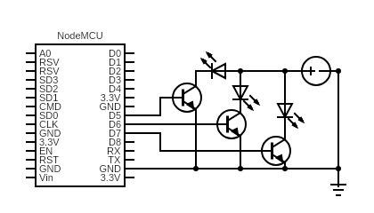

  

  

<h1 align="center">Radlet Plankton</h1>

---

The Radlet ecosystem was created keeping *speed* and *flexibility* in mind and thus making edge computing a little more easier for people who wish to tinker. The existing IOT solutions are either proprietary or are too tightly coupled for a regular user to tinker with. We bring the speed of coupled system and the flexibility of a decoupled system with the perfectly balanced IOT ecosystem - Radlet. The ecosystem consists of **three primary components** out of which this repository hold the code for **Radlet-Plankton**.
      

## Table of Contents :octocat:

- [Getting Started](#getting_started)
- [Deployment](#deployment)
- [Usage](#usage)
- [Authors](#authors)

## 1. Getting Started :four_leaf_clover: 

This project Platform IO for Firmware development. The recommended IDE for development is VS Code which gels nicely with the Platform IO SDK. To setup Platform IO SDK on your machine, follow the Platform IO [docs](https://platformio.org/install/ide?install=vscode) accordingly.

### 1.a Prerequisites

- Platform IO
- A little knowledge of how Arduino code is structured
- A decent knowledge of C++

### 1.b Build

The build build step is as simple as pressing **upload** button while on VS Code. If the physical device is connected to the development machine and the right port is selected then the firmware code should be flased without a few seconds onto the ESP8266 chip.
  
### 1.c Circuit Diagram

  

---  

## 2. Deployment :fire: 

Simply flash an ESP8266 chip with our firmware and you are good to go. Plug it in with a 5v power suppy and it should power on within a few seconds.

---

## 3. Usage :closed_book: 

If the Radlet Dock has been deployed successfully on the network, and the Composer app has been installed on your android device, you can simply power on an ESP8266 microcontroller chip with our firmware on it. The device should show up immediately on the discovery screen of the phone app.

---

## 4. Authors :hammer: 

- [@AakashMallik](https://github.com/AakashMallik)  
- [@Prithvi](https://github.com/Prithviii)

---

## 5. Sponsor this Project
- [Buy me a coffee :coffee:](https://www.buymeacoffee.com/4gmBYV0)  
